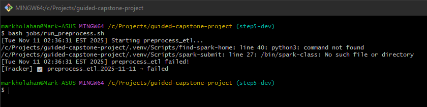
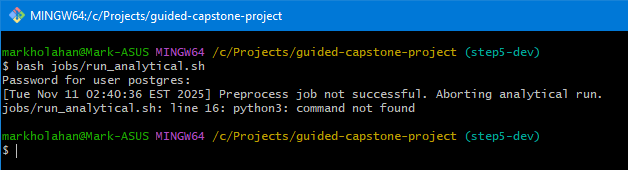
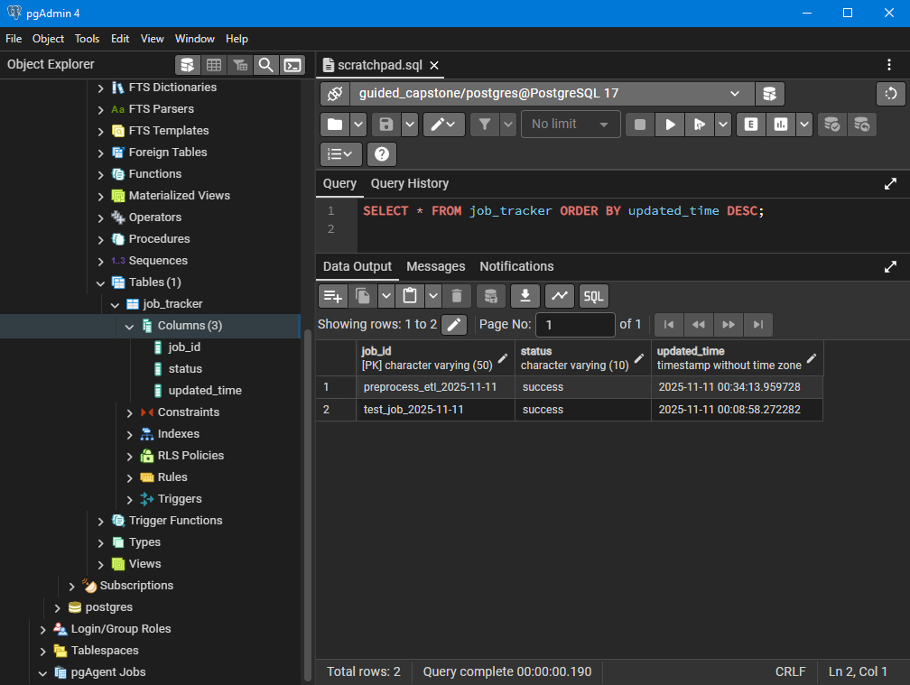

# 💹 Spring Capital Market Data Pipeline  
**Springboard Data Engineering Bootcamp — Guided Capstone Project** 
**Author:** Mark Holahan 
**Version:** v5.0 (final submission) 
**Branch:** `step5-submission` → `main` merge candidate


### 🧭 Overview

This Guided Capstone demonstrates the design and implementation of a **cloud-oriented data engineering pipeline** for **Spring Capital**, an investment bank analyzing high-frequency trade and quote data.
 The system ingests, cleanses, enriches, and reports on equity market data across multiple exchanges using scalable batch-processing techniques.

The project follows a five-step engineering lifecycle:

1. **Architecture & Design** — Defined system flow and data model.
2. **Data Ingestion** — Parsed multi-exchange trade and quote data from semi-structured sources (CSV/JSON).
3. **End-of-Day Load** — Normalized and stored processed data to persistent cloud storage.
4. **Analytical ETL** — Produced business metrics such as daily trade summaries, moving averages, and spread analytics.
5. **Pipeline Orchestration** — Automated workflows with job dependency and PostgreSQL-based job status tracking.

------

### ⚙️ **Architecture**

**Components**

- **Source Layer:** Raw CSV and JSON trade/quote files from NYSE and NASDAQ exchanges.
- **Processing Layer:** PySpark jobs for ingestion, partitioning, and analytical ETL.
- **Storage Layer:** Azure Blob Storage (cloud) and PostgreSQL (metadata + job tracker).
- **Control Layer:** Bash scripts orchestrating ETL execution, job dependencies, and tracker updates.

**Data Flow**

```
Raw Files → Spark Ingestion → Partitioned Parquet Output → Analytical ETL → PostgreSQL Tracker
```

------

### 🧩 **Key Technologies**

| Category             | Technology                                                |
| -------------------- | --------------------------------------------------------- |
| Language             | Python 3.11                                               |
| Processing Framework | Apache Spark 3.x (PySpark)                                |
| Database             | PostgreSQL 17                                             |
| Orchestration        | Bash Shell Scripts                                        |
| Cloud Storage        | Azure Blob Storage                                        |
| Development Tools    | VS Code, pgAdmin, Git, Databricks (for prior development) |

------

### 🧱 **Repository Structure**

```
guided-capstone-project/
│
├── config/
│   ├── config.ini                # Database and runtime configuration
│   └── config.sample.ini
│
├── data/                         # Sample input data (CSV, JSON)
│
├── etl/
│   └── src/
│       ├── run_data_ingestion.py # Step 2–3: Ingestion workflow
│       ├── run_reporter.py       # Step 4: Analytical ETL
│       └── tracker.py            # Step 5: PostgreSQL job tracker
│
├── jobs/
│   ├── run_preprocess.sh         # Step 5.1: Launches ingestion, updates tracker
│   └── run_analytical.sh         # Step 5.2: Launches analytical ETL (dependent)
│
├── notebooks/
│   ├── step3_eod_data_load.ipynb # Spark EOD load logic
│   └── step4_analytical_etl.ipynb# Analytical ETL logic
│
├── README.md
└── requirements.txt
```

------

### 🧭 **Pipeline Execution Flow**

A) **Run Preprocessing Job**

```bash
bash jobs/run_preprocess.sh
```

- Executes ingestion job (`run_data_ingestion.py`)
- Updates tracker table with `success` or `failed`.

**Figure 1 – Preprocess Job Execution**



> The above screenshot shows the local execution of `bash jobs/run_preprocess.sh` from Git Bash.
> The job fails gracefully because Spark is not active locally, demonstrating the pipeline’s
> error-handling and tracker integration.


B) **Run Analytical Job**

```bash
bash jobs/run_analytical.sh
```

- Checks PostgreSQL for `preprocess_etl` status.
- Runs analytics only if preprocessing succeeded.
- Updates tracker with `success` or `blocked`.

**Figure 2 – Analytical Workflow Blocked Due to Dependency**



> This output from `bash jobs/run_analytical.sh` confirms that the pipeline correctly
> checks the `preprocess_etl` job’s status in PostgreSQL and prevents downstream execution
> when the dependency fails.


C) **Verify Tracker Table**

```sql
SELECT * FROM job_tracker ORDER BY updated_time DESC;
```

------

### 📊 **Job Tracker Design**

| Column         | Type        | Description                                          |
| -------------- | ----------- | ---------------------------------------------------- |
| `job_id`       | VARCHAR(50) | Unique identifier, e.g., `preprocess_etl_2025-11-11` |
| `status`       | VARCHAR(10) | Job state (`success`, `failed`, `blocked`)           |
| `updated_time` | TIMESTAMP   | Time of last status update                           |

**Example Output (pgAdmin):**

```
 job_id                | status  | updated_time
-----------------------------------------------
 preprocess_etl_2025-11-11 | success | 2025-11-11 00:34:13
 analytical_etl_2025-11-11 | blocked | 2025-11-11 00:35:41
```


**Figure 3 – PostgreSQL Job Tracker Table**



> This pgAdmin view confirms that job states are written to PostgreSQL with proper timestamps.
> Both successful and failed job entries are tracked persistently.


------

### 🧠 **Core Classes**

#### `Tracker` (`etl/src/tracker.py`)

Implements:

- `assign_job_id()` → Generates unique daily job ID.
- `update_job_status()` → Writes success/failure to PostgreSQL.
- `get_job_status()` → Retrieves latest job execution state.

This enables reliable, auditable orchestration in PostgreSQL.

------

### 🚀 **Results**

The pipeline simulates a production-grade data environment:

- **Automated orchestration:** Fully functional workflow dependency between ingestion and analytics.
- **Fault-tolerance:** Errors are captured and job states updated automatically.
- **Traceability:** PostgreSQL provides a persistent audit trail of job runs.
- **Scalability:** Modular design allows future integration with Databricks or Airflow.

------

### 📸 Evidence Summary

| Figure | Description                   | Demonstrates                        |
| ------ | ----------------------------- | ----------------------------------- |
| 1      | Preprocess Job Output         | Shell orchestration, error handling |
| 2      | Analytical Job Blocked Output | Job dependency logic                |
| 3      | PostgreSQL Tracker            | Persistent job status tracking      |


------

## 🏁 Conclusion

This Guided Capstone — *Spring Capital Market Data Pipeline* — demonstrates the end-to-end engineering lifecycle from ingestion to orchestration using Apache Spark, Bash automation, and PostgreSQL tracking.  

The project focuses on **reliability, modularity, and observability**, modeling production-grade control flow through explicit dependency checks and persistent job status tracking.  

Beyond meeting rubric requirements, it serves as a foundation for scalable, cloud-based data engineering practices — a bridge between classical ETL design and modern lakehouse architecture.

---

## 🔗 Relation to Unguided Capstone

This Guided Capstone laid the groundwork for architectural and orchestration concepts expanded in my Unguided Capstone, *TMDB + Discogs Integration Pipeline*.  

While this project emphasizes **local orchestration and job tracking**, the Unguided Capstone extends those principles into a **fully cloud-native lakehouse** running on Azure Databricks and Data Lake Gen2.

| Concept             | Guided Capstone (This Project)         | Unguided Capstone                                        |
| ------------------- | -------------------------------------- | -------------------------------------------------------- |
| **Execution Layer** | Local Spark & Bash orchestration       | Databricks Notebooks & Jobs API                          |
| **Tracking**        | PostgreSQL Job Tracker                 | Azure Monitor + Log Analytics                            |
| **Storage**         | Local filesystem & Azure Blob          | Azure Data Lake Gen2                                     |
| **Focus**           | Workflow orchestration, fault handling | Distributed schema harmonization & cross-API integration |

Together, these two capstones showcase the evolution from **foundational ETL architecture** to **enterprise-scale, cloud-native engineering**.

---

© 2025 Mark Holahan — Springboard Data Engineering Bootcamp  

> “Pipelines end, but data flows on.”
